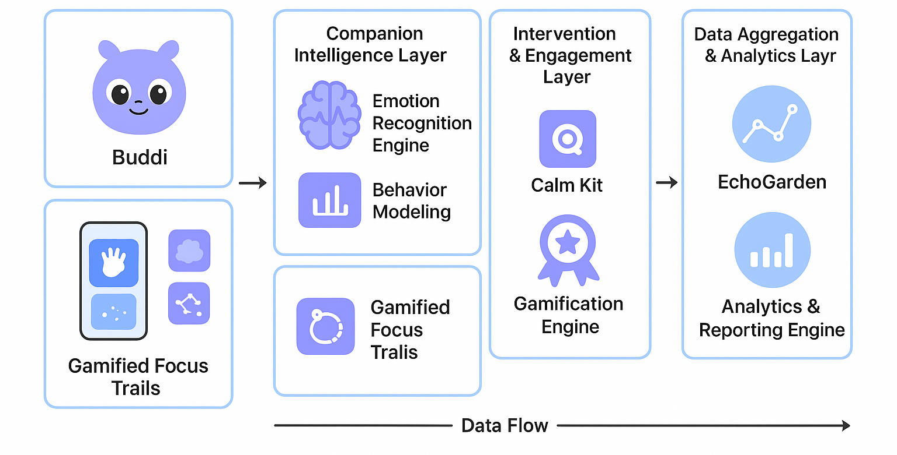

# *System Architecture*

The *Buddi system architecture* is designed as an *integrated, modular, and scalable ecosystem* that seamlessly combines *affective computing, ambient sensing, and adaptive interaction design*. Its architecture ensures *real-time emotional support*, *personalized engagement*, and *privacy-preserving classroom analytics*.  

## **1. Overview**

At a high level, Buddi consists of *four interconnected layers*:

1. **User Interaction Layer** – Interfaces through which students engage with Buddi.  
2. **Companion Intelligence Layer** – Core logic managing the virtual companion, emotional modeling, and adaptive behavior.  
3. **Intervention & Engagement Layer** – Micro-interventions, gamification modules, and real-time feedback mechanisms.  
4. **Data Aggregation & Analytics Layer** – Classroom-level insights, emotion trend mapping, and secure data management.

Each layer communicates through *API endpoints and event-driven pipelines*, ensuring *low-latency response* while maintaining *data privacy and modularity*.

---

## **2. Layer Details**

### **A. User Interaction Layer**
- **Components:**
  - *Virtual Companion UI:* A playful, responsive creature that mirrors the student’s mood, engagement, and habits.  
  - *Micro-Intervention Widgets:* Sensory-friendly exercises, guided breathing, doodling, and grounding gestures.  
  - *Gamified Focus Trails:* Progress bars, constellations, and soft visual cues encouraging task completion and emotional regulation.  
- **Technology Stack:**
  - Frontend: React Native / Flutter for cross-platform support.  
  - UI/UX Framework: Material Design + soft gamification elements.  
- **Responsibilities:**
  - Capture *student interactions* (touch, click, duration, engagement).  
  - Provide *immediate feedback* based on the Companion Intelligence Layer.  
  - Ensure *low-stimulation, accessible design* for neurodivergent learners.

---

### **B. Companion Intelligence Layer**
- **Components:**
  - *Emotion Recognition Engine:* Uses *ambient sensor data* (optional wearables, keyboard/mouse patterns, facial expressions) to infer emotional states.  
  - *Behavior Modeling Module:* Maintains a *dynamic profile* of each student’s habits, mood patterns, and responsiveness.  
  - *Adaptive Response Generator:* Decides *appropriate companion reactions*, micro-interventions, and encouragement prompts.  
- **Technology Stack:**
  - Backend: Python / Node.js  
  - ML Models: Lightweight affective computing models (TensorFlow Lite or PyTorch Mobile)  
- **Responsibilities:**
  - Translate raw sensor input into *quantitative emotional metrics*.  
  - Update *companion behavior dynamically* to ensure meaningful, empathetic interactions.  
  - Trigger *context-aware micro-interventions* without disrupting classroom flow.

---

### **C. Intervention & Engagement Layer**
- **Components:**
  - *Micro-Intervention Scheduler:* Determines timing and type of interventions based on emotional and engagement data.  
  - *Gamification Engine:* Generates *soft rewards, progress visualizations, and focus trails* to motivate self-regulation.  
  - *Feedback Loop:* Collects *interaction data* to refine intervention effectiveness using reinforcement learning.  
- **Technology Stack:**
  - Event-driven backend using WebSockets / MQTT for real-time updates.  
  - Gamification logic implemented in frontend with server validation for consistency.  
- **Responsibilities:**
  - Encourage *habit formation* and *consistent emotional regulation*.  
  - Provide *instant, playful feedback* to sustain engagement.  
  - Avoid overstimulation or intrusive notifications.

---

### **D. Data Aggregation & Analytics Layer**
- **Components:**
  - *Classroom Mood Dashboard (EchoGarden):* Visualizes aggregated mood patterns across the classroom without exposing individual identities.  
  - *Analytics & Reporting Engine:* Generates *trend analysis, engagement reports, and intervention effectiveness metrics* for educators.  
  - *Secure Storage & Privacy Layer:* Ensures *data encryption, anonymization*, and *compliance with privacy standards*.  
- **Technology Stack:**
  - Database: PostgreSQL / Firebase Realtime Database  
  - Analytics: Python Pandas / Plotly / D3.js  
- **Responsibilities:**
  - Provide *actionable insights to teachers* while maintaining *student privacy*.  
  - Identify *stress hotspots* or patterns of emotional overload.  
  - Store *longitudinal behavioral data* to inform companion personalization over time.

---

## **3. Data Flow**

1. **Input:** Student interacts via UI or ambient sensors detect emotional cues.  
2. **Processing:** Companion Intelligence Layer analyzes inputs and determines emotional state.  
3. **Intervention:** Engagement Layer triggers *micro-interventions* or gamified feedback.  
4. **Aggregation:** Data is anonymized and sent to Analytics Layer for classroom-level insights.  
5. **Feedback Loop:** Insights refine *behavior models*, improving future companion responses and interventions.

---

## **4. Security & Privacy Considerations**
- **Data Anonymization:** No personally identifiable information stored in aggregated analytics.  
- **Encrypted Communication:** All frontend-backend interactions are over *TLS/HTTPS*.  
- **Local-First Processing:** Emotion recognition and companion behavior logic can run *locally on the device*, minimizing cloud dependency.  

---

## **5. Scalability**
- Modular design allows for:
  - *Adding new interventions* or gamification mechanics.  
  - *Extending to multiple classrooms or schools* without significant backend reconfiguration.  
  - Integration with *wearables or IoT classroom sensors* in the future.

---

*In summary*, Buddi’s architecture combines *playful, adaptive interaction design* with *robust emotion analytics* to create a *scalable, privacy-conscious digital ecosystem* that *proactively supports neurodivergent learners* while empowering educators with *actionable, anonymized insights*.

  <a href="layers.html" class="right-link">Next : Layers</a>

